## «λόγος», Logos, “word”

### Application for language & linguistics communities on Discord

#### Find definitions, translate text, detect languages, read guides, play games, submit resources, answer questions

##### Examples - Pronunciation - Inflection - Etymologies - Relations - Expressions - Usage Notes

   

     

### Language Support

- 📖 Definitions available for words in the above listed languages, sourced variously from **Wiktionary**, **Dexonline**,
  **Dicolink**, **Wordnik**, and **WordsAPI**, with a **PONS** integration on the way.
- 🌐 Translation available in 250 languages, provided variously by **DeepL**, **Google Translate** and **Lingvanex**.
- 🔍 Detection available in 200 languages, provided variously by `tinyld`, `cld`, `fasttext` and `eld`.
- 🔤 Localisations available for 18 languages:
    - Great support (90%+): 🇩🇪 German 🇵🇱 Polish 🇷🇴 Romanian
    - Good support (60%+): 🇫🇷 French 🇳🇱 Dutch 🇹🇷 Turkish 🇳🇴 Norwegian
    - Limited support (30%+) 🇭🇺 Hungarian 🇦🇲 Armenian (Western) 🇦🇲 Armenian (Eastern)
    - Poor support (0%+) 🇪🇸 Spanish, 🇫🇮 Finnish, 🇸🇪 Swedish, 🇺🇳 Silesian

### Community Aspect

- 🎶 Audio playback with advanced track manipulation, queue + history management, first-class playlist support, and more.
- 🧳 Intuitive, unique role management using a folder-like role selection menu.
- 💢 Moderation tools, including user verification, user reports, a warning + pardoning system, fine-tunable slowmode,
  message purging, rule citation, policy viewing, and more.
- 💐 Social features including viewing user profiles and thanking users for their contributions.

#### [Message @vxern for a demo](https://discord.com/users/217319536485990400) · [Join the Logos community](https://discord.gg/TWdAjkTfah) · [Contribute to the project](CONTRIBUTING.md) · [Set the bot up for yourself](CONTRIBUTING.md)

<table>
  <tbody>
    <tr>
      <td style="text-align: center">
        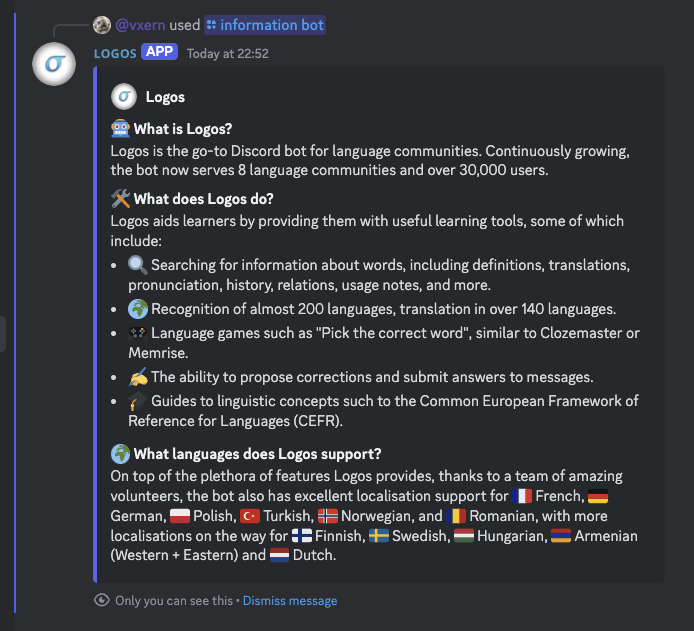
      </td>
      <td style="text-align: center">
        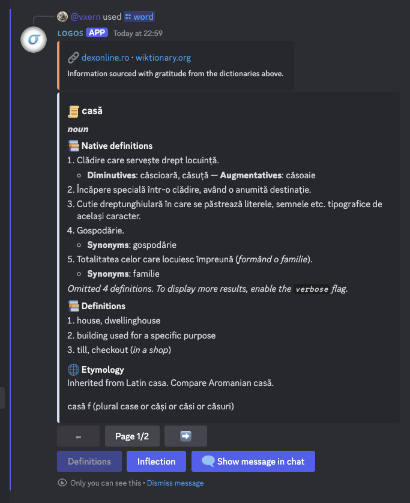
      </td>
    </tr>
    <tr>
      <td style="text-align: center">
        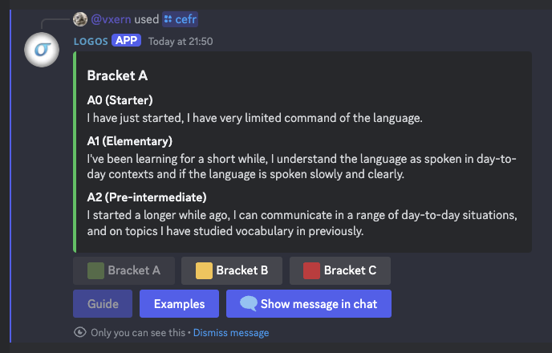
      </td>
      <td style="text-align: center">
        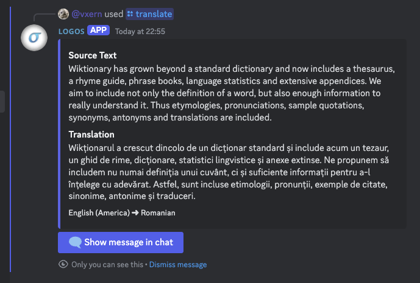
      </td>
    </tr>
    <tr>
      <td style="text-align: center">
        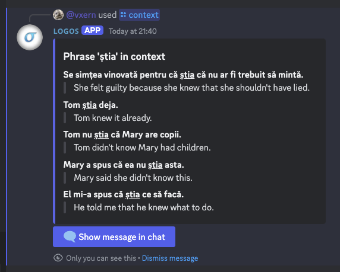
      </td>
      <td style="text-align: center">
        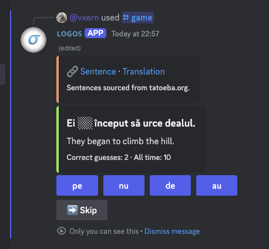
      </td>
    </tr>
    <tr>
      <td style="text-align: center">
        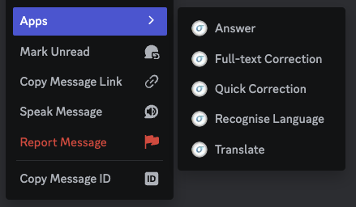
      </td>
      <td style="text-align: center">
        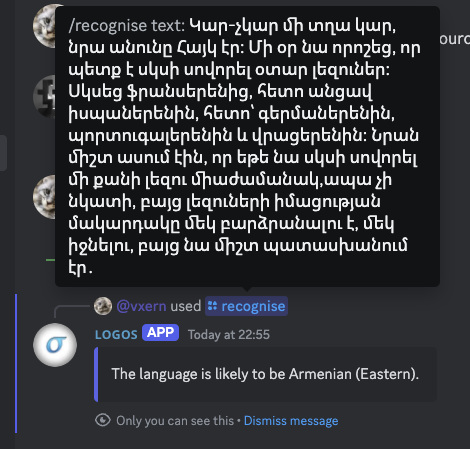
      </td>
    </tr>
    <tr>
      <td style="text-align: center">
        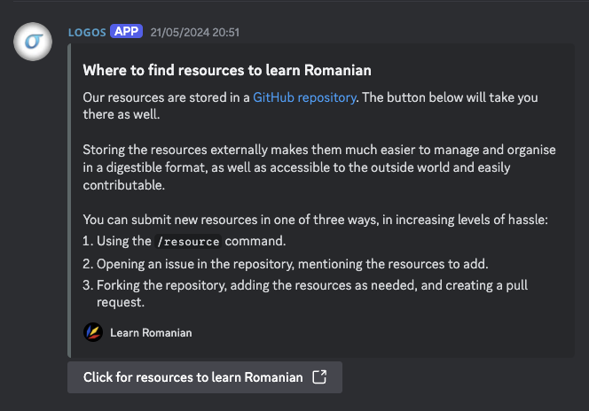
      </td>
      <td style="text-align: center">
        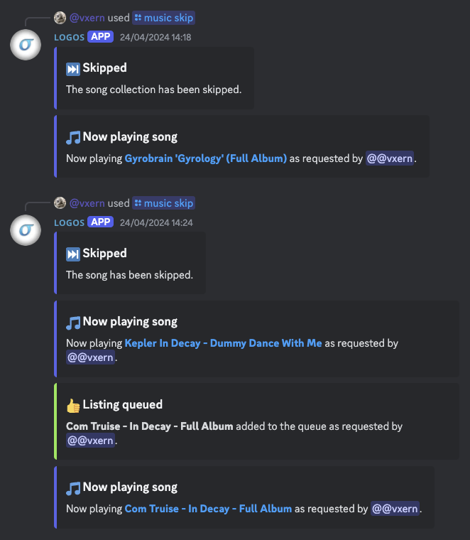
      </td>
    </tr>
    <tr>
      <td style="text-align: center">
        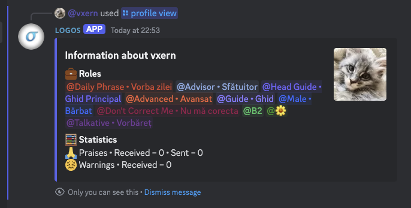
      </td>
    </tr>
    <tr>
      <td style="text-align: center">
        
      </td>
      <td style="text-align: center">
        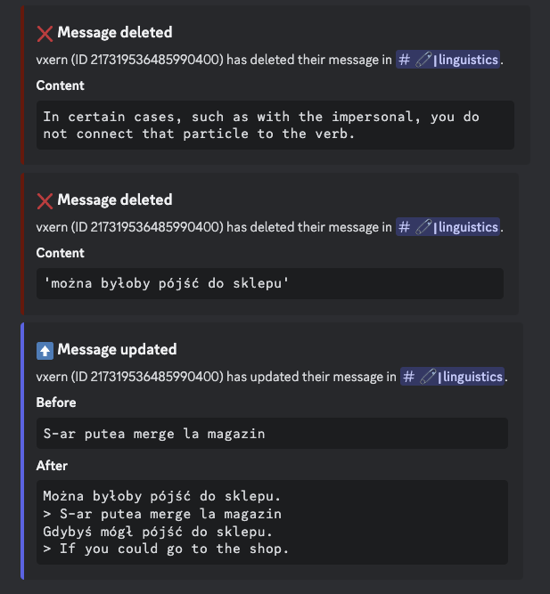
      </td>
    </tr>
    <tr>
      <td style="text-align: center">
        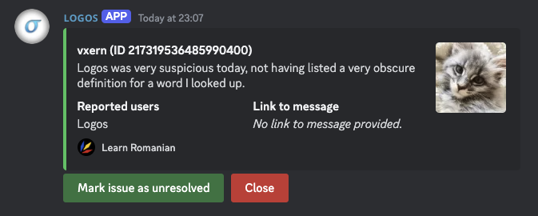
      </td>
      <td style="text-align: center">
        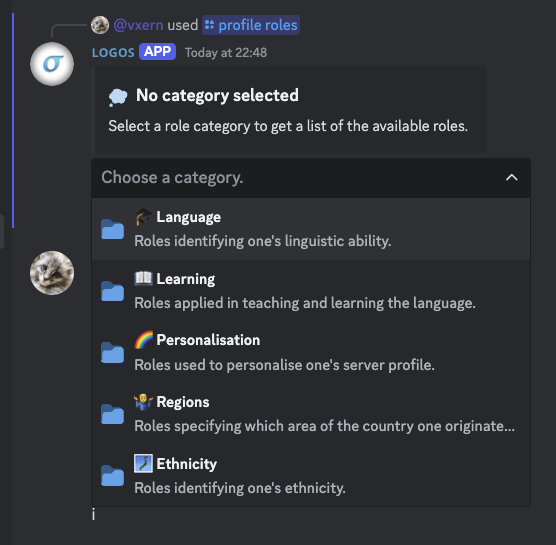
      </td>
    </tr>
    <tr>
      <td style="text-align: center">
        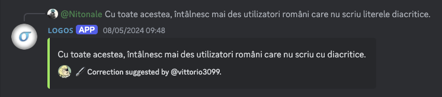
      </td>
      <td style="text-align: center">
        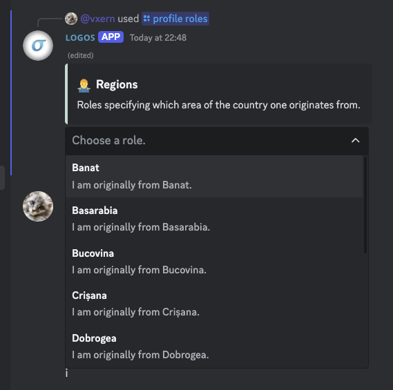
      </td>
    </tr>
    <tr>
      <td style="text-align: center">
        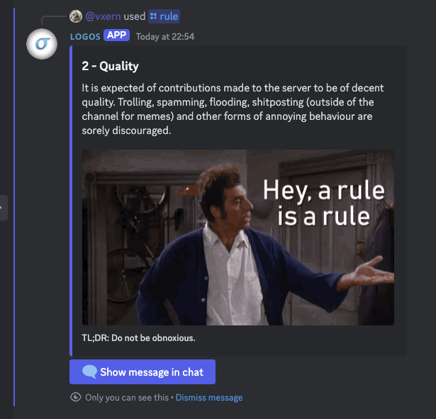
      </td>
      <td style="text-align: center">
        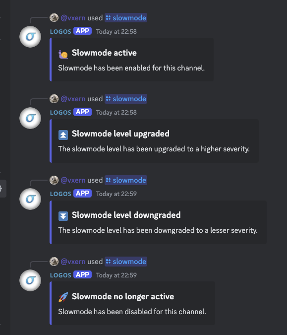
      </td>
    </tr>
    <tr>
      <td style="text-align: center">
        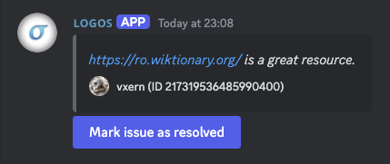
      </td>
      <td style="text-align: center">
        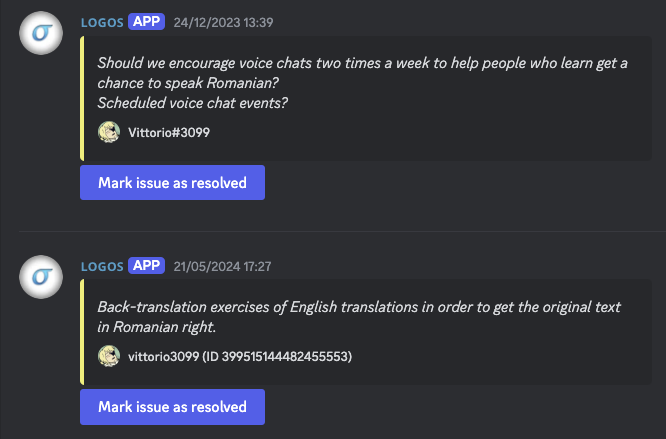
      </td>
    </tr>
  </tbody>
</table>

### Communities

Check out some of the communities already using Logos to help their users learn languages!

<table>
  <tbody>
    <tr>
      <td style="text-align: center">
        <a href="https://discord.gg/h5qqty7">
          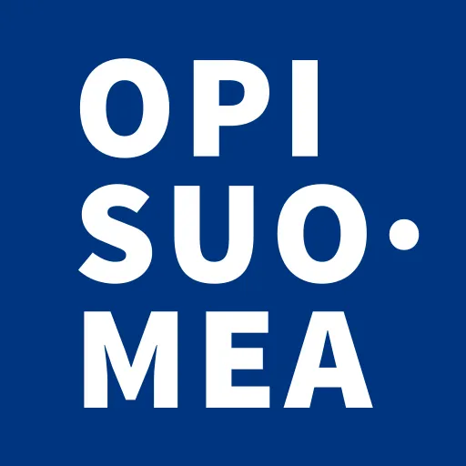
           
          
           <b>Learn Finnish</b>
          
        </a>
         
      </td>
      <td style="text-align: center">
        <a href="https://discord.gg/4U7Akj6">
          
           
          
           <b>Learn Polish</b>
          
        </a>
         
      </td>
      <td style="text-align: center">
        <a href="https://discord.gg/yAfQUpMMZ8">
          
           
          
           <b>Svenska - Learn Swedish</b>
          
        </a>
         
      </td>
      <td style="text-align: center">
        <a href="https://discord.gg/kBj3a7n">
          
           
          
           <b>Learn Romanian</b>
          
        </a>
         
      </td>
    </tr>
    <tr>
      <td style="text-align: center">
        <a href="https://discord.gg/VsqppQ6">
          
           
          
           <b>Learn Hungarian ≈ Danuvia 🇭🇺</b>
          
        </a>
         
      </td>
      <td style="text-align: center">
        <a href="https://discord.gg/xwgAysRrZU">
          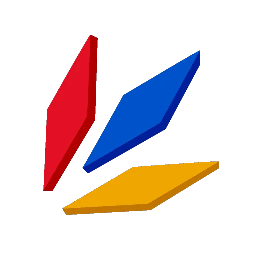
           
          
           <b>Learn Armenian</b>
          
        </a>
         
      </td>
      <td style="text-align: center">
        <a href="https://discord.gg/JWzrNvEQK5">
          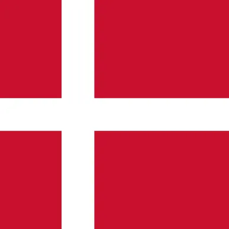
           
          
           <b>Learn Danish Society Server</b>
          
        </a>
         
      </td>
      <td style="text-align: center">
        <a href="https://discord.gg/tA5HUGzM7E">
          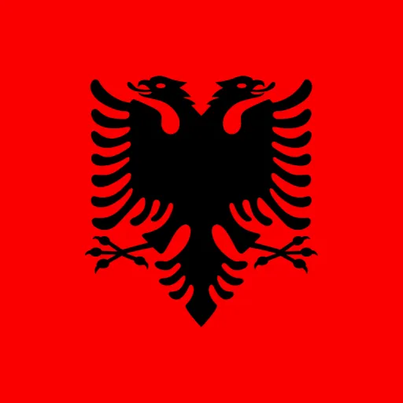
           
          
           <b>Learn Albanian - Language Server</b>
          
        </a>
         
      </td>
    </tr>
    <tr>
      <td style="text-align: center">
        <a href="https://discord.gg/da2x7pUXfz">
          
           
          
           <b>Silcord - Silesian discord</b>
          
        </a>
         
      </td>
      <td style="text-align: center">
        <a href="https://discord.gg/98kx9wCzxr">
          
           
          
           <b>Learn Slovak & Czech</b>
          
        </a>
         
      </td>
      <td style="text-align: center">
        <a href="https://discord.com/invite/J53v628">
          
           
          
           <b>বাংলা (Bengal)</b>
          
        </a>
         
      </td>
      <td style="text-align: center">
        <a href="https://discord.gg/mk6XDDFv">
          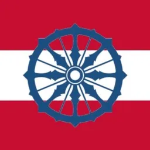
           
          
           <b>ଓଡ଼ିଶା (Odisha)</b>
          
        </a>
         
      </td>
    </tr>
  </tbody>
</table>

### Contributors

<!-- ALL-CONTRIBUTORS-LIST:START - Do not remove or modify this section -->
<!-- prettier-ignore-start -->
<!-- markdownlint-disable -->
<table>
  <tbody>
    <tr>
      <td align="center" valign="top" width="14.28%"><a href="https://github.com/vxern"> <b>Dorian Oszczęda</b></a> <a href="#maintenance-vxern" title="Maintenance">🚧</a> <a href="https://github.com/vxern/logos/commits?author=vxern" title="Code">💻</a> <a href="#translation-vxern" title="Translation">🌍</a> <a href="#design-vxern" title="Design">🎨</a> <a href="https://github.com/vxern/logos/commits?author=vxern" title="Tests">⚠️</a></td>
      <td align="center" valign="top" width="14.28%"><a href="https://github.com/2colours"> <b>Nemokosch</b></a> <a href="#infra-nemokosch" title="Infrastructure (Hosting, Build-Tools, etc)">🚇</a> <a href="#userTesting-nemokosch" title="User Testing">📓</a> <a href="#translation-nemokosch" title="Translation">🌍</a> <a href="#ideas-nemokosch" title="Ideas, Planning, & Feedback">🤔</a></td>
      <td align="center" valign="top" width="14.28%"><a href="https://github.com/16wardm"> <b>Mattheos</b></a> <a href="#translation-16wardm" title="Translation">🌍</a> <a href="#userTesting-16wardm" title="User Testing">📓</a> <a href="#ideas-16wardm" title="Ideas, Planning, & Feedback">🤔</a></td>
      <td align="center" valign="top" width="14.28%"><a href="https://youtube.com/channel/UC4aqpjKwQfkqxmQO0Owy2QQ"> <b>Victor</b></a> <a href="#userTesting-ferb02" title="User Testing">📓</a> <a href="#translation-ferb02" title="Translation">🌍</a> <a href="#ideas-ferb02" title="Ideas, Planning, & Feedback">🤔</a></td>
      <td align="center" valign="top" width="14.28%"> <b>Mymy</b> <a href="#userTesting-mymy" title="User Testing">📓</a> <a href="#ideas-mymy" title="Ideas, Planning, & Feedback">🤔</a></td>
      <td align="center" valign="top" width="14.28%"> <b>Annie</b> <a href="#userTesting-bean__queen" title="User Testing">📓</a> <a href="#ideas-bean__queen" title="Ideas, Planning, & Feedback">🤔</a></td>
      <td align="center" valign="top" width="14.28%"> <b>Kamel</b> <a href="#translation-kamelNeoN" title="Translation">🌍</a> <a href="#ideas-kamelNeoN" title="Ideas, Planning, & Feedback">🤔</a></td>
    </tr>
    <tr>
      <td align="center" valign="top" width="14.28%"> <b>Paul</b> <a href="#translation-vittorio3099" title="Translation">🌍</a> <a href="#ideas-vittorio3099" title="Ideas, Planning, & Feedback">🤔</a></td>
      <td align="center" valign="top" width="14.28%"> <b>Alaska</b> <a href="#translation-at.peace" title="Translation">🌍</a></td>
      <td align="center" valign="top" width="14.28%"><a href="https://x.com/_stechi_"> <b>Asterfields</b></a> <a href="#translation-asterfields_" title="Translation">🌍</a></td>
      <td align="center" valign="top" width="14.28%"> <b>aura</b> <a href="#translation-adeniial" title="Translation">🌍</a></td>
      <td align="center" valign="top" width="14.28%"> <b>eagely</b> <a href="#translation-eagely" title="Translation">🌍</a></td>
      <td align="center" valign="top" width="14.28%"> <b>Esther</b> <a href="#translation-estheroide" title="Translation">🌍</a></td>
      <td align="center" valign="top" width="14.28%"> <b>Haniel</b> <a href="#translation-hani_men12" title="Translation">🌍</a></td>
    </tr>
    <tr>
      <td align="center" valign="top" width="14.28%"> <b>iiv</b> <a href="#translation-iiv" title="Translation">🌍</a></td>
      <td align="center" valign="top" width="14.28%"><a href="https://github.com/a-mcego"> <b>Mega Glaceon</b></a> <a href="#translation-megaglaceon" title="Translation">🌍</a></td>
      <td align="center" valign="top" width="14.28%"><a href="https://instagram.com/mike_dishakjian"> <b>Mike</b></a> <a href="#translation-rottingrat666" title="Translation">🌍</a></td>
      <td align="center" valign="top" width="14.28%"> <b>Moorddroom</b> <a href="#translation-moorddroom" title="Translation">🌍</a></td>
      <td align="center" valign="top" width="14.28%"> <b>Noxys</b> <a href="#translation-noxys" title="Translation">🌍</a></td>
      <td align="center" valign="top" width="14.28%"> <b>Okruch Chleba</b> <a href="#translation-okruchchleba" title="Translation">🌍</a></td>
      <td align="center" valign="top" width="14.28%"> <b>Pascu</b> <a href="#ideas-pascu" title="Ideas, Planning, & Feedback">🤔</a></td>
    </tr>
    <tr>
      <td align="center" valign="top" width="14.28%"> <b>Rodut Notira</b> <a href="#translation-rodutnotira" title="Translation">🌍</a></td>
      <td align="center" valign="top" width="14.28%"><a href="mailto:macmillantrenton@gmail.com"> <b>Telemaniak</b></a> <a href="#translation-telemaniak" title="Translation">🌍</a></td>
      <td align="center" valign="top" width="14.28%"> <b>Theodenin Muhafizi</b> <a href="#translation-theodeninmuhafizi" title="Translation">🌍</a></td>
      <td align="center" valign="top" width="14.28%"> <b>Yeetfe</b> <a href="#translation-yeetfe" title="Translation">🌍</a></td>
    </tr>
  </tbody>
</table>

<!-- markdownlint-restore -->
<!-- prettier-ignore-end -->

<!-- ALL-CONTRIBUTORS-LIST:END -->
